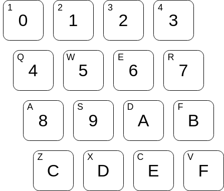

# CHIP-8 Interpretter

This is a github repository containing code written for a Chip-8 Interpretter.  The code was written in C++ and uses SDL for handling graphics and user input.  The documentation used for my implemenation can be found here: http://devernay.free.fr/hacks/chip8/C8TECH10.HTM

## Dependencies
This program requires SDL2 for compilation.  These can be installed by running:

`apt-get install libsdl2-dev`

## Usage
The program can be compiled using the provided CMake files.  Once the program has been built it can be run with:

`./chip8 /path/to/ch8/rom`

## Controls
Currently the Chip-8's hexadecimal keyboard has been mapped in the following manner:

## Saving and Loading State
Currently the interpretter can save/load state by pressing "P" and "L".  The interpretter allows for only one state save regardless of the loaded program.

## Future Changes
-Allow modification of keyboard mapping

## Update/Changelog
V1.5 Added audio support.

V1.4: Added Save/Load state via pressing "P" and "L" respectively.  Adjusted FPS.

V1.3: Added ajdustable window dimensions, pausing on lost focus/minimized window.

V1.2: Added random color scheming via pressing "T"

V1.1: Fixed screen flickering issues, improved FPS, fixed exiting by x-ing out of window.  Added Makefile for compilation.

V1.0: Functioning Interpretter